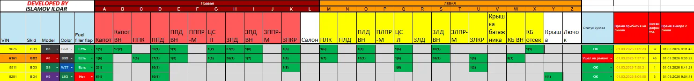
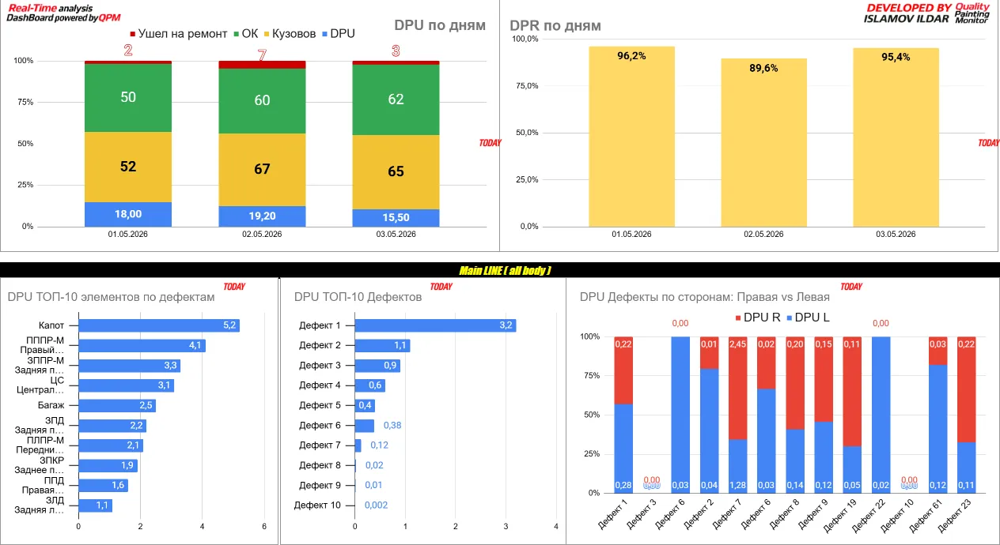
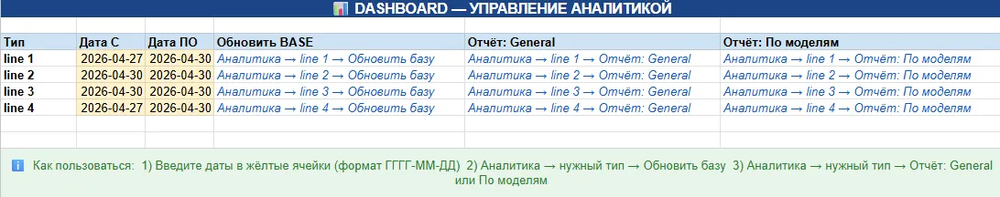
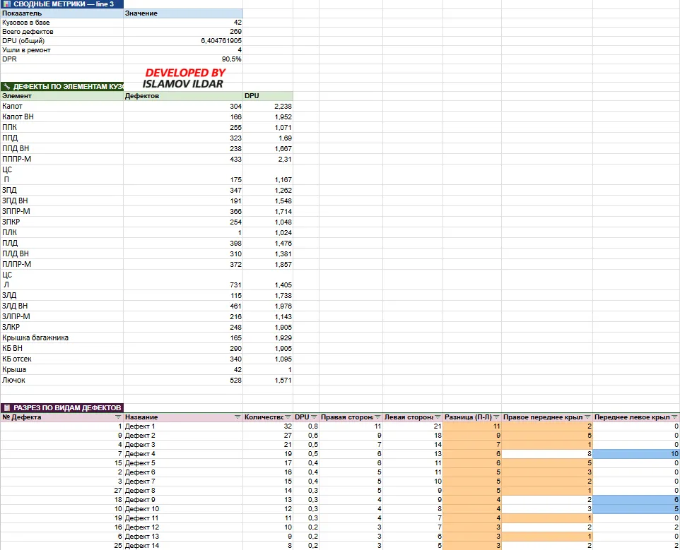
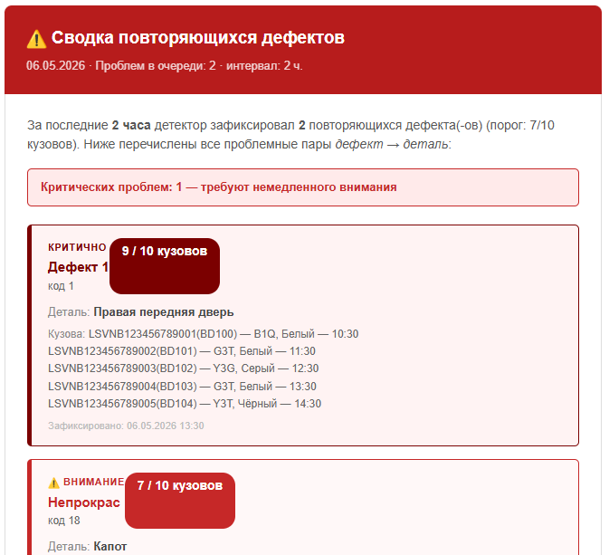
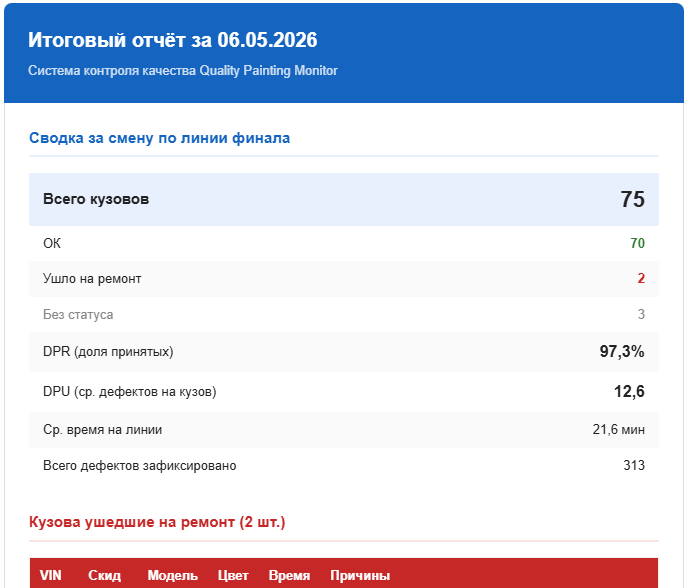
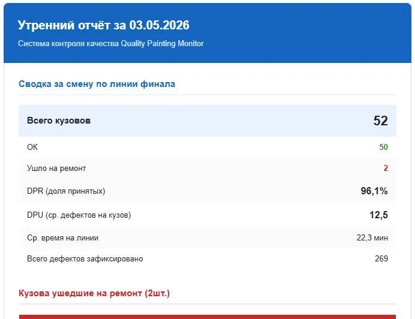
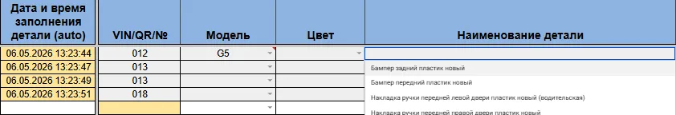
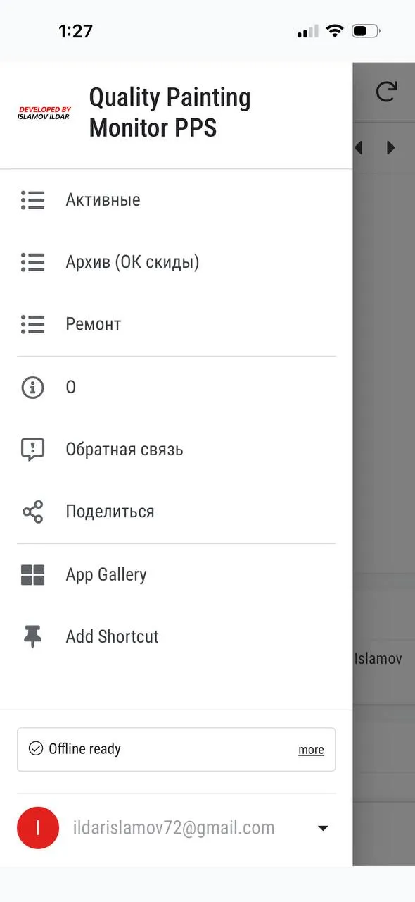

eng / ru — bilingual post — двуязычный пост 
<!-- Английский заголовок с якорем -->

# Paint Shop Quality Control System (ENG)
[Читать на русском](#ru)

**Two shops. Eight lines. Real-time data where there was none.**

---

## The Problem

Production was running blind.

Defects were recorded on paper — on one line out of six. The other five recorded nothing. Data surfaced at the end of the shift, if at all. By the time a pattern became visible, hundreds of car bodies had already passed through.

No one asked for a fix. I built one anyway.

---

## What Was Built

A full-cycle quality monitoring platform covering two paint shops — from data entry to automated reporting. Designed, developed, and deployed by one person in one month.

| | |
|---|---|
| Shops | 2 |
| Lines monitored | 8 |
| Daily users | 50+ |
| Records per day | 350+ |
| Records per month | 7,000+ |
| In production | 4+ months |

---

## What Changed

| Before | After |
|---|---|
| Paper records on 1 of 6 lines | Digital records on all 8 lines |
| Data visible end of shift | Data visible within seconds |
| Patterns identified manually | Anomalies detected in minutes |
| Shift reports compiled by hand | Reports generated and sent automatically |
| No history | 7,000+ records per month, fully queryable |
| Repair prep started on arrival | Repair prep starts before the car body arrives |

---

## Beyond Automotive

The architecture is not industry-specific.

Any process with a structured flow and a quality control point can be mapped onto this system: data collection → normalization → real-time monitoring → anomaly detection → reporting. Manufacturing, logistics, laboratory, field inspection — the pattern is the same.

---

## Stack

`Google Apps Script` `Google Sheets` `PostgreSQL` `AppSheet` `Looker Studio`  
`JavaScript` `SQL` `IMPORTRANGE / QUERY ETL` `LockService` `ScriptProperties`

---

## A Note on Scope

This system was not part of my job description. My role was statistics.

I saw that data existed but wasn't being captured. I built the infrastructure to capture it, make it useful, and deliver it automatically to the people who needed it.

That is the difference between analyzing data and building the systems that create it.

---

## How It Works

### Layer 1 — Data Collection

Operators enter defects from tablets directly on the line. Each car body gets a digital record: identifier, model, defect codes, location, timestamp, status.

Defect entry matrix by body element and line. All data shown is anonymised and does not reflect real production.

Free-text input is normalized automatically — `2 3`, `2,3`, `2/3` all become `2(3)`. A car body identifier typed as `125` becomes `BD125`. The data is always clean before it reaches analytics.

Concurrent access from multiple tablets is handled through a write-ahead log via `ScriptProperties` + `LockService`. No data loss under race conditions.

Six lines, four files. Each file reflects exactly its line — no universal compromises, no redundant columns.

### Layer 2 — Analytics

Two independent levels for two different questions.

**Real time** — what is happening right now. Dashboards update automatically within seconds of data entry. No manual action required.

- 12 dashboards · 56 charts
- DPU and DPR by day
- Top defects and elements — today
- Left vs. right side comparison by model
- Defect symmetry per model — systemic vs. local

Live dashboard: DPU/DPR by day, top defects, top elements, left vs. right side breakdown. All data shown is anonymised and does not reflect real production.

**On demand** — what happened over a period. Select a line, set dates, get a full report.

Report control panel: select line, set date range, run report. Interface is live; data shown is anonymised.

- Summary metrics: units, defects, DPU, DPR
- Breakdown by defect type, body element, and car model
- Left/right side delta — highlights directional patterns
- Conditional formatting: problem areas visible without reading numbers

Report output: summary metrics, defect breakdown by element and type, left/right delta. All data shown is anonymised and does not reflect real production.

### Layer 3 — Alert System

The detector runs every 5 minutes. It looks at the last 10 car bodies with a confirmed status — a sliding window. If the same defect appears on the same element in 7 out of 10 bodies, a threshold is breached.

Alert digest sent every 2 hours. Real email interface; all data shown is anonymised and does not reflect real production.

Alerts are batched into a digest sent every 2 hours — not one email per trigger. Each defect-element pair has a 2-hour cooldown to prevent duplicates. The result: one structured email with everything that matters, no noise.

The end-of-shift report is generated and sent automatically — 18 minutes before the shift ends. Management sees DPU, DPR, the repair list, and defect breakdown before the line stops. No one compiles it manually.

Automatic end-of-shift report with DPU, DPR, repair list, and defect breakdown. All data shown is anonymised and does not reflect real production.

Both systems are fully configurable from a spreadsheet. Add a recipient, exclude a noisy defect, assign responsibility for a specific defect type — no code changes required.

Configuration table for the alert and reporting system. Recipients, thresholds, and responsibilities are managed here — no code changes required.

### Layer 4 — Repair Flow

When a car body is sent to the repair chamber, it carries a compact defect cipher — letters for body elements, numbers for defect types. `A1,2,B3` means: element A has defects 1 and 2, element B has defect 3.

Repair workers read the cipher before the car body arrives. Preparation starts in advance. After repair, they log what was done, time spent, and exit status. The data feeds back into the analytics layer automatically.

---

## Second Shop — Own Initiative

The plastic parts shop ran on Excel with no automation.

I wrote to management, scheduled a meeting, scoped the requirements, and built the system independently. Different shop, different people, different process — different design decisions.

The plastic shop uses a different input model: one row per defect per part, not per car body. Dynamic dropdowns generated from named ranges — the model selection narrows the color list, which narrows the parts list. Operators never see irrelevant options.

Dynamic dropdown: model selection narrows the parts list in real time. Interface is live; data shown is anonymised.

The analytics layer calculates two DPR variants — standard pass rate and pass rate including line-side corrections. Sequential grouping logic handles re-entries of the same car body as distinct visits, not duplicates.

---

## Mobile App
*Two backend variants · not in production · an honest account*

---

The current data entry system runs through Google Sheets on tablets. The app was built as the next step: a proper interface with a role model, per-post data isolation, and built-in defect and model references.

Built twice with different backends:
- **AppSheet + Google Sheets** — fast start, hit the UX flexibility ceiling
- **AppSheet + PostgreSQL (NeonDB)** — normalised schema, Looker Studio connected directly to the database

AppSheet mobile app: navigation menu with active records, archive, and repair sections. Live interface.

Each user sees only their own data — profile, role, shift, and line are locked at login. An inspector on post 3 cannot see data from post 1.

### Why Not in Production

Feedback was positive — but the rollout didn't happen. The reason is not the app. Right now one person simultaneously inspects the car body and enters data. The app requires slightly more steps than the spreadsheet — and in that context it matters. The spreadsheet wins because it's familiar and more primitive.

The right fix is organisational: split the roles. One person inspects, another enters. Until that change happens, the app won't deliver the advantage that outweighs inertia.

Next version — a full web app with no no-code constraints: HTML, CSS, JavaScript, Supabase or NeonDB.

---

| Component | Status |
|---|---|
| AppSheet + Sheets | Built, tested, frozen |
| AppSheet + PostgreSQL | Built, tested, frozen |
| Next version (web) | Planned |

*Frozen — not abandoned.*

---

If you'd like to discuss a project or potential collaboration — [LinkedIn ↗️](https://www.linkedin.com/in/islamov-ildar) · [ildarislamov72@gmail.com](mailto:ildarislamov72@gmail.com)

---
<!-- Русский заголовок с якорем -->

# Система контроля качества окрасочного цеха (RU)
[Read in English](#eng)

**Два цеха. Восемь линий. Данные в реальном времени там, где их не было.**

---

## Проблема

Производство работало вслепую.

Дефекты фиксировались на бумаге — и только на одной линии из шести. Остальные пять не записывали ничего. Данные появлялись в конце смены, если вообще появлялись. К тому моменту, когда паттерн становился виден, через линию уже прошли сотни кузовов.

Никто не просил это исправить. Я сделал это сам.

---

## Что было сделано

Полноцикловая платформа контроля качества для двух окрасочных цехов — от ввода данных до автоматической отчётности. Спроектировано, разработано и запущено одним человеком за один месяц.

| | |
|---|---|
| Цехов | 2 |
| Линий под мониторингом | 8 |
| Ежедневных пользователей | 50+ |
| Записей в день | 350+ |
| Записей в месяц | 7 000+ |
| В продакшне | 4+ месяца |

---

## Что изменилось

| До | После |
|---|---|
| Бумажные записи на 1 из 6 линий | Цифровые записи на всех 8 линиях |
| Данные видны в конце смены | Данные видны в течение секунд |
| Паттерны выявляются вручную | Аномалии обнаруживаются за минуты |
| Отчёты по смене составляются вручную | Отчёты формируются и отправляются автоматически |
| Нет истории | 7 000+ записей в месяц, полностью доступны для анализа |
| Подготовка к ремонту начинается по прибытии кузова | Подготовка начинается до прибытия кузова |

---

## За пределами автопрома

Архитектура не привязана к отрасли.

Любой процесс со структурированным потоком и точкой контроля качества можно отобразить на эту систему: сбор данных → нормализация → мониторинг в реальном времени → обнаружение аномалий → отчётность. Производство, логистика, лаборатория, полевые инспекции — паттерн один и тот же.

---

## Стек

`Google Apps Script` `Google Sheets` `PostgreSQL` `AppSheet` `Looker Studio`  
`JavaScript` `SQL` `IMPORTRANGE / QUERY ETL` `LockService` `ScriptProperties`

---

## О масштабе работы

Эта система не входила в мои должностные обязанности. Моя роль была — статистика.

Я увидел, что данные существуют, но не фиксируются. Я построил инфраструктуру, чтобы их захватить, сделать полезными и автоматически доставлять людям, которым они нужны.

Вот в чём разница между анализом данных и построением систем, которые их создают.

---

## Как это работает

### Слой 1 — Сбор данных.

Операторы вводят дефекты с планшетов прямо на линии. Каждый кузов получает цифровую запись: идентификатор, модель, коды дефектов, расположение, временная метка, статус.

Матрица ввода дефектов по элементам кузова и линиям. Все данные обезличены и не имеют отношения к реальному производству. Интерфейс рабочий.

Свободный ввод нормализуется автоматически — `2 3`, `2,3`, `2/3` — всё становится `2(3)`. Идентификатор кузова, введённый как `125`, становится `BD125`. Данные всегда чистые до того, как попадают в аналитику.

Одновременный доступ с нескольких планшетов обрабатывается через журнал записей с упреждением через `ScriptProperties` + `LockService`. Потери данных при конкурентном доступе исключены.

Шесть линий, четыре файла. Каждый файл отражает ровно свою линию — никаких универсальных компромиссов, никаких лишних столбцов.
*[Подробнее про сбор данных →](./RU/01-paint-shop-data-collection.md).*

### Слой 2 — Аналитика

Два независимых уровня для двух разных вопросов.

**Реальное время** — что происходит прямо сейчас. Дашборды обновляются автоматически в течение секунд после ввода данных. Никаких ручных действий.

- 12 дашбордов · 56 графиков
- DPU и DPR по дням
- Топ дефектов и элементов — сегодня
- Сравнение левой и правой стороны по моделям
- Симметрия дефектов по модели — системные vs. локальные

Живой дашборд: DPU/DPR по дням, топ дефектов, топ элементов, сравнение левой и правой стороны. Все данные обезличены и не имеют отношения к реальному производству. Интерфейс рабочий.

**По запросу** — что происходило за период. Выбираешь линию, задаёшь даты, получаешь полный отчёт.

Панель управления отчётом: выбор линии, задание периода, запуск. Интерфейс рабочий; данные обезличены.

- Сводные метрики: единицы, дефекты, DPU, DPR
- Разбивка по типу дефекта, элементу кузова и модели автомобиля
- Дельта левой/правой стороны — выделяет направленные паттерны
- Условное форматирование: проблемные зоны видны без чтения цифр

Результат отчёта: сводные метрики, разбивка дефектов по элементам и типам, дельта сторон. Все данные обезличены и не имеют отношения к реальному производству. Интерфейс рабочий.

### Слой 3 — Система алертов

Детектор запускается каждые 5 минут. Он смотрит на последние 10 кузовов с подтверждённым статусом — скользящее окно. Если один и тот же дефект появляется на одном и том же элементе в 7 из 10 кузовов — порог пробит.

Дайджест алертов, отправляется каждые 2 часа. Реальный интерфейс письма; все данные обезличены и не имеют отношения к реальному производству.

Алерты группируются в дайджест и отправляются каждые 2 часа — не одно письмо на каждое срабатывание. Каждая пара «дефект–элемент» имеет 2-часовой кулдаун для предотвращения дублей. Результат: одно структурированное письмо со всем важным, без шума.

Отчёт по концу смены формируется и отправляется автоматически — за 18 минут до окончания смены. Руководство видит DPU, DPR, список ремонтов и разбивку дефектов до остановки линии. Никто не составляет это вручную.

Автоматический отчёт по смене: DPU, DPR, список ремонтов, разбивка дефектов. Все данные обезличены и не имеют отношения к реальному производству. Интерфейс рабочий.

Обе системы полностью настраиваются из таблицы. Добавить получателя, исключить шумный дефект, назначить ответственного за конкретный тип дефекта — изменений в коде не требуется.

Таблица конфигурации системы алертов и отчётности. Получатели, пороги и ответственные управляются отсюда — без изменений в коде.

### Слой 4 — Ремонтный поток

Когда кузов отправляется в ремонтную камеру, он несёт компактный шифр дефектов — буквы для элементов кузова, цифры для типов дефектов. `A1,2,B3` означает: элемент A имеет дефекты 1 и 2, элемент B — дефект 3.

Ремонтники читают шифр до прибытия кузова. Подготовка начинается заранее. После ремонта они фиксируют выполненные работы, затраченное время и статус выхода. Данные автоматически возвращаются в аналитический слой.

---

## Второй цех — собственная инициатива

Цех пластиковых деталей работал в Excel без какой-либо автоматизации.

Я написал руководству, назначил встречу, собрал требования и построил систему самостоятельно. Другой цех, другие люди, другой процесс — другие проектные решения.

В цехе пластика используется другая модель ввода: одна строка на дефект на деталь, а не на кузов. Динамические выпадающие списки из именованных диапазонов — выбор модели сужает список цветов, который сужает список деталей. Операторы никогда не видят нерелевантные варианты.

Динамический список: выбор модели сужает список деталей в реальном времени. Интерфейс рабочий; данные обезличены.

Аналитический слой считает два варианта DPR — стандартный процент годных и процент годных с учётом исправлений на линии. Логика последовательной группировки обрабатывает повторные въезды одного кузова как отдельные визиты, а не дубликаты.

---

# Мобильное приложение
*Два варианта бека · не в продакшне · честная история*

---

Текущая система работает через Google Sheets на планшетах. Приложение создавалось как следующий шаг: профессиональный интерфейс с ролевой моделью, изоляцией данных по постам и справочниками внутри.

Разрабатывалось на разных бекендах:
- **AppSheet + Google Sheets** — быстрый старт, потолок по гибкости UX
- **AppSheet + PostgreSQL (NeonDB)** — нормализованная схема, Looker Studio напрямую к базе

Мобильное приложение AppSheet: меню навигации с активными записями, архивом и ремонтом. Живой интерфейс.

Каждый пользователь видит только свои данные — профиль, роль, смена, линия зашиты при входе. Контролёр с поста 3 не видит данные поста 1.

---

## Почему не в продакшне

Фидбек был положительный — но переход не состоялся. Причина не в приложении: пока один человек одновременно осматривает кузов и вносит данные, таблица быстрее. Нужно разделить роли — это организационное решение, не техническое.

Следующая версия — веб-приложение без no-code ограничений: HTML, CSS, JavaScript, Supabase или NeonDB.

---

| Компонент | Статус |
|---|---|
| AppSheet + Sheets | Заморожено |
| AppSheet + PostgreSQL | Заморожено |
| Следующая версия (веб) | В планах |

*Заморожено — не брошено.*

---

Если интересно обсудить проект или сотрудничество — [LinkedIn ↗️](https://www.linkedin.com/in/islamov-ildar) · [ildarislamov72@gmail.com](mailto:ildarislamov72@gmail.com)
